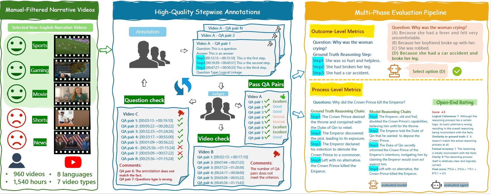

# VRBench

<!-- [](https://arxiv.org/abs/2506.10857) -->

This repository contains the implementation of VRBench
> **VRBench: A Benchmark for Multi-Step Reasoning in Long Narrative Videos**<br>
> [Jiashuo Yu](https://scholar.google.com/citations?user=iH0Aq0YAAAAJ&hl=zh-CN)<sup>∗</sup>, [Yue Wu](https://github.com/May010129)<sup>∗</sup>, [Meng Chu](https://github.com/OpenGVLab/VRBench)<sup>∗</sup>, [Zhifei Ren](https://github.com/OpenGVLab/VRBench)<sup>∗</sup>, [Zizheng Huang](https://github.com/OpenGVLab/VRBench)<sup>∗</sup>, [Pei Chu](https://github.com/OpenGVLab/VRBench)<sup>∗</sup>, [Ruijie Zhang](https://github.com/OpenGVLab/VRBench), [Yinan He](https://github.com/OpenGVLab/VRBench), [Qirui Li](https://github.com/OpenGVLab/VRBench), [Songze Li](https://github.com/OpenGVLab/VRBench), [Zhenxiang Li](https://github.com/OpenGVLab/VRBench), [Zhongying Tu](https://github.com/OpenGVLab/VRBench), [Conghui He](https://conghui.github.io/), [Yu Qiao](https://mmlab.siat.ac.cn/yuqiao), [Yali Wang](https://scholar.google.com/citations?user=hD948dkAAAAJ&hl=zh-CN)<sup>+</sup>, [Yi Wang](https://shepnerd.github.io/)<sup>+</sup>, [Limin Wang](https://wanglimin.github.io/)<sup>+</sup><br>
> International Conference on Computer Vision, ICCV 2025

## Updates

[08/2025] The camera-ready version of VRBench has been released! Check the [arxiv](https://arxiv.org/abs/2506.10857) paper for the new updates.

[07/2025] VRBench has been fully open-sourced! Check our data on [Huggingface](https://huggingface.co/datasets/OpenGVLab/VRBench)!

[06/2025] VRBench has been accepted to ICCV2025!

## Installation

### 1. Create a Python 3.11 environment (conda example)
```bash
conda create -n vrbench python=3.11 -y
conda activate vrbench
```

### 2. Install required packages
```bash
python -m pip install -r requirements.txt
```

## Usage

### 1. Run inference (generate model answers)
See `inference/README.md` for full details. Minimal example:
```bash
python inference/main.py \
  --model "Qwen/Qwen2-VL-7B-Instruct" \
  --data_path "inference/data/VRBench_debug.jsonl" \
  --video_root "/path/to/VRBench" \
  --output_dir "inference/debug_outputs"
```
This command loads a local model (path configured in `inference/utils/constant.py`) and produces an **inference JSONL**.

### 2. Rate answers with DeepSeek
See `evaluation/README.md` – example:
```bash
python evaluation/batch_evaluation_api_mp_time_sync.py \
  --source_file  inference/debug_outputs/Qwen2-VL-7B_16frame.jsonl \
  --summary_file evaluation/data_for_eval/VRBench_summary.jsonl \
  --output_file  evaluation/eval_outputs/Qwen2-VL-7B_evaluation.jsonl \
  --model        deepseek \
  --api_key      $DEEPSEEK_KEY \
  --base_url     https://api.deepseek.com/v1
```
This step creates an **evaluation JSONL** containing `rate` values.

### 3. Compute VRBench scores
```bash
python evaluation/calculate_scores.py \
  --ground_truth_file evaluation/data_for_eval/VRBench_eval.jsonl \
  --inference_file    inference/debug_outputs/Qwen2-VL-7B_16frame.jsonl \
  --evaluation_file   evaluation/eval_outputs/Qwen2-VL-7B_evaluation.jsonl \
  --model_name        Qwen2-VL-7B
```
Results are printed in a table and optionally saved to JSON.

For advanced options (batch scripts, adaptive frame logic, custom models) please read the dedicated READMEs in `inference/` and `evaluation/`.

## Overview


We present VRBench, the first long narrative video benchmark crafted for evaluating large models' multi-step reasoning capabilities, addressing limitations in existing evaluations that overlook temporal reasoning and procedural validity. It comprises 960 long videos (with an average duration of 1.6 hours), along with 8,243 human-labeled multi-step question-answering pairs and 25,106 reasoning steps with timestamps. These videos are curated via a multi-stage filtering process including expert inter-rater reviewing to prioritize plot coherence. We develop a human-AI collaborative framework that generates coherent reasoning chains, each requiring multiple temporally grounded steps, spanning seven types (e.g., event attribution, implicit inference). VRBench designs a multi-phase evaluation pipeline that assesses models at both the outcome and process levels. Apart from the MCQs for the final results, we propose a progress-level LLM-guided scoring metric to evaluate the quality of the reasoning chain from multiple dimensions comprehensively. Through extensive evaluations of 12 LLMs and 19 VLMs on VRBench, we undertake a thorough analysis and provide valuable insights that advance the field of multi-step reasoning.

## Citation

If you find our repo useful for your research, please consider citing our paper:

        @article{yu2025vrbench,
          title={VRBench: A Benchmark for Multi-Step Reasoning in Long Narrative Videos},
          author={Yu, Jiashuo and Wu, Yue and Chu, Meng and Ren, Zhifei and Huang, Zizheng and Chu, Pei and Zhang, Ruijie and He, Yinan and Li, Qirui and Li, Songze and others},
          journal={arXiv preprint arXiv:2506.10857},
          year={2025}
        }

## Acknowledgement

### VRBench Contributors

> [Jiashuo Yu](https://scholar.google.com/citations?user=iH0Aq0YAAAAJ&hl=zh-CN), [Yue Wu](https://github.com/May010129), [Zhifei Ren](https://github.com/OpenGVLab/VRBench), [Zizheng Huang](https://github.com/OpenGVLab/VRBench), [Meng Chu](https://github.com/OpenGVLab/VRBench)

### Open-Sourced Repositories

The code of this project mainly follows [MMVU](https://github.com/yale-nlp/MMVU), a valuable multi-discipline video understanding and reasoning benchmark!